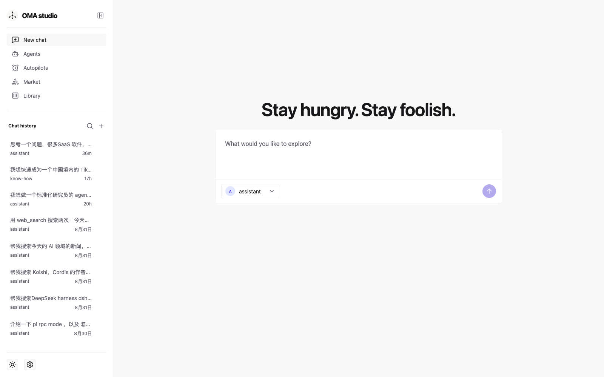
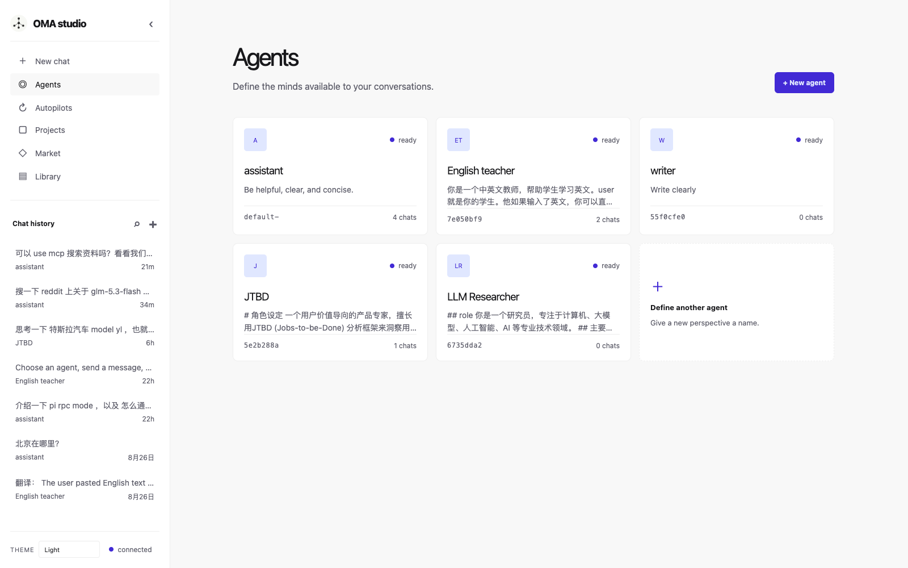
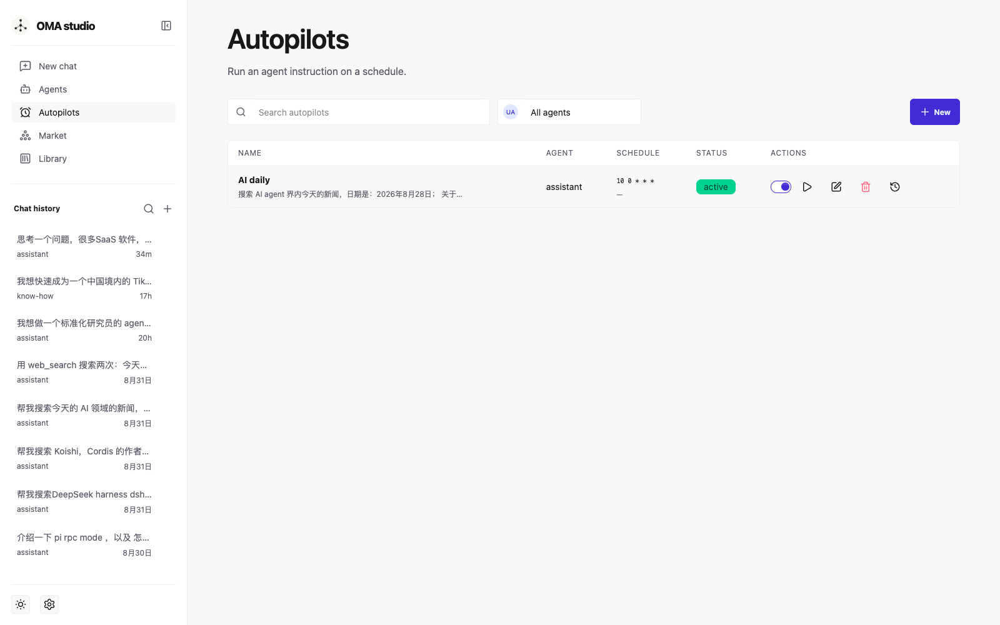
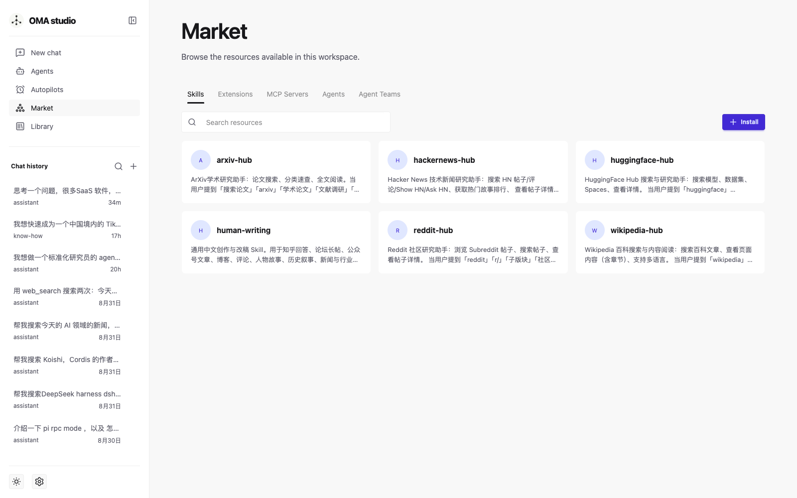
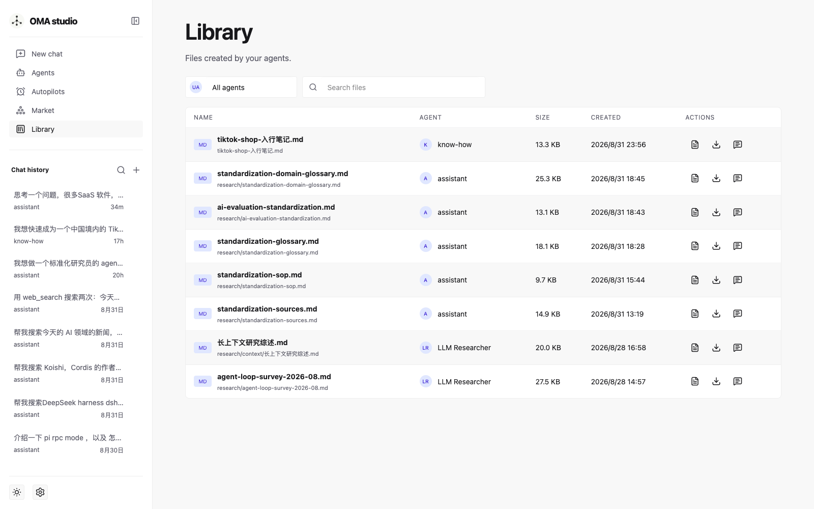
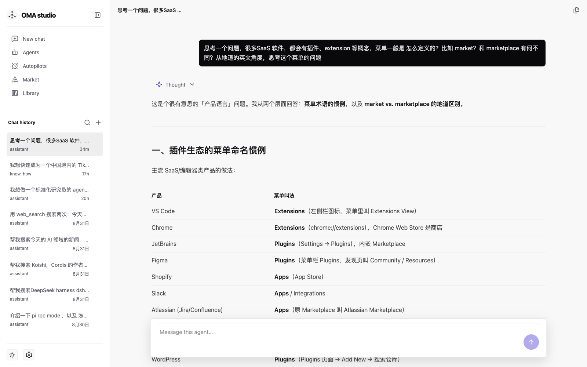

# OMA Studio

An experimental, local-first agent platform built with **FastAPI**, **Pi RPC mode**, and a lightweight **Alpine.js + DaisyUI** web interface.

OMA Studio explores a practical separation of concerns:

- Pi owns agent execution, tool calls, streaming events, and durable session transcripts.
- The platform owns agents, chat metadata, resource discovery, and the web experience.
- TinyDB stores only platform metadata; it does not duplicate Pi message history.

> Status: MVP / active experiment. APIs, storage, and sandboxing integrations may change.

## Screenshots

<table>
  <tr>
    <td width="50%" valign="top">
      <h3>New chat</h3>
      
      <p>Start a Pi session by selecting an Agent once, then send the first message.</p>
    </td>
    <td width="50%" valign="top">
      <h3>Agents</h3>
      
      <p>Define reusable Agents with instructions, models, tools, skills, extensions, and MCP servers.</p>
    </td>
  </tr>
  <tr>
    <td width="50%" valign="top">
      <h3>Autopilots</h3>
      
      <p>Schedule Agent instructions, run them immediately, inspect run history, and open linked Chat sessions. <a href="https://studio.ohmyagent.ai/autopilots">Open Autopilots</a>.</p>
    </td>
    <td width="50%" valign="top">
      <h3>Marketplace</h3>
      
      <p>Browse workspace Skills, Extensions, and MCP Servers; search and install Skills from skills.sh. <a href="https://studio.ohmyagent.ai/market">Open Marketplace</a>.</p>
    </td>
  </tr>
  <tr>
    <td width="50%" valign="top">
      <h3>Library</h3>
      
      <p>Search, filter, preview, download, and open files generated by Agents. <a href="https://studio.ohmyagent.ai/library">Open Library</a>.</p>
    </td>
    <td width="50%" valign="top">
      <h3>Chat detail</h3>
      
      <p>Chat with Markdown, tool activity, generated files, editable titles, and a fixed header. <a href="https://studio.ohmyagent.ai/chat/264e2f2d-2295-4e79-a975-f14f11ba2731">Open the example session</a>.</p>
    </td>
  </tr>
</table>

## Features

- Chat with Pi through RPC mode, including streamed assistant output.
- Pi-managed session history, addressable at `/chat/<chat-id>`.
- Markdown rendering for assistant messages, code blocks, tables, lists, thinking, tool calls, and collapsible tool results.
- Generated-file drawer for Chat sessions, with metadata cards and a new-tab Markdown viewer with Mermaid support.
- Library page aggregating Agent-created files with Agent filtering, name search, pagination, download, and source-chat links.
- Autopilots for scheduled Agent instructions, manual runs, run history, and linked Chat sessions.
- Agent definitions with instruction, Provider, Model, built-in tool allowlist, extensions, skills, and MCP servers.
- Marketplace discovery of Pi resources, plus skills.sh search and skill installation.
- System, Light, and Dark themes managed from Settings → General; new visitors follow their system preference by default.
- JSONL request tracing with `X-Request-ID` correlation and persistent Docker-mounted logs.
- A small operational CLI: `bin/ops.sh start|stop|restart|status|logs` (Docker Compose mode).

## Design principles

- **Pi is the source of truth for messages.** The platform does not copy message transcripts into TinyDB.
- **One Agent per chat.** An Agent's instruction, Provider, Model, tool allowlist, extensions, skills, and MCP selection are fixed when a chat starts.
- **Explicit capability selection.** Discovering a resource does not enable it. Agents must opt in to tools, extensions, skills, and MCP servers.
- **Local-first, sandbox-ready.** The MVP runs locally for fast iteration, while its execution boundary is designed to move behind a future `SandboxRunner`.

## Architecture

```text
Browser (Alpine.js + DaisyUI)
        │ HTTP / SSE
        ▼
FastAPI
  ├── TinyDB: agents + chat metadata
  ├── Pi resource discovery
  ├── JSONL logs + request tracing → host-mounted `PI_LOG_DIR`
  └── Pi RPC bridge
          │ JSONL RPC
          ▼
      Pi coding agent
  ├── Pi session JSONL history
  ├── tools / extensions / skills
  └── MCP adapter (optional)
```

### Request flow

```text
New chat
  → TinyDB creates a chat record using the chat UUID as Pi session ID
  → first user message starts Pi RPC with that Agent configuration
  → FastAPI proxies JSONL events as SSE to the browser
  → Pi persists the transcript in its session directory

Open history
  → FastAPI starts a short Pi RPC process with --session <chat-id>
  → asks Pi for get_messages
  → renders the Pi-managed transcript
```

The session UUID is deliberately shared between platform metadata and Pi. This avoids a mapping layer and keeps Pi session files authoritative.

## Prerequisites

- Python 3.11+
- [uv](https://docs.astral.sh/uv/)
- A local [Pi coding agent](https://github.com/earendil-works/pi)
- A configured Pi provider credential, such as DeepSeek

## Quick start

```bash
cp .env.example .env
bin/ops.sh start
# Alternate host port for this invocation:
bin/ops.sh start 8080
# Local development server with uvicorn hot reload:
bin/ops.sh start-dev 8000
```

`ops.sh` runs the platform in Docker Compose (app layer + process layer in one
container, storage on host mounts — see [Docker](#docker)); no `uv sync` required for
this path.

`start-dev` runs `uv run uvicorn` directly from the repository root with
`--reload`; it does not start Docker.

Open <http://127.0.0.1:8000>. To avoid a host-port conflict, pass a port to
`start` or `restart`, for example `bin/ops.sh restart 8080`, then open
<http://127.0.0.1:8080>. The equivalent explicit form is `-p 8080`.

### Docker

Run the whole platform in one lightweight container — the app layer (FastAPI + web UI)
and the process layer (Pi CLI, curl, jq, Trafilatura, ripgrep, fd, git) share a single image; all state stays
on the host through bind mounts:

```bash
docker compose up --build
```

| Mount | Container path | Purpose |
| --- | --- | --- |
| `${PI_PLATFORM_DATA_DIR:-./data}` | `/app/data` | Platform metadata + Pi session transcripts |
| `${PI_CWD:-./workspace}` | `${PI_DOCKER_CWD:-/workspace}` | Agent working directory |
| `${PI_LOG_DIR:-./logs}` | `/app/logs` | Rotating JSONL application logs with request IDs |
| `${PI_HOST_HOME:-~/.pi/agent}` | `/home/node/.pi/agent` | Extensions, skills, MCP config, model catalog, provider auth |
| `${PI_HOST_AGENTS_HOME:-~/.agents}` | `/home/node/.agents` | Agent-neutral shared skills |

Compose reads `.env` for `PI_PROVIDER`, `PI_MODEL`, the resource defaults, `PI_PLATFORM_DATA_DIR`,
`PI_CWD`, `PI_LOG_DIR`, `PI_HOST_HOME`, `PI_HOST_AGENTS_HOME`, and optional `PI_DOCKER_CWD`; container-internal paths are fixed in `docker-compose.yml`. This means a local
`.env` with `PI_PLATFORM_DATA_DIR=data` shares the repository's existing metadata and Pi
sessions with Docker. No reverse proxy or extra services — FastAPI serves the API and UI
directly, and `init: true` reaps the short-lived Pi subprocesses the app spawns. When the
host reaches model providers through a VPN/proxy, set `OMA_PROXY` (e.g. with
Colima: `http://192.168.5.2:7897`) and the container pins its outbound model
calls to it via Node 24 proxy support.

The image includes `curl` and `jq` for ordinary HTTP and JSON debugging from an
Agent's `bash` tool. Prefer the structured `web_fetch` and `web_search` tools for
web research; `curl_cffi` is not bundled because it is a specialized TLS
impersonation client rather than a drop-in replacement for standard `curl`. The
image also includes the pinned `trafilatura` CLI for extracting readable text
and Markdown from HTML. Update `TRAFILATURA_VERSION` in the Dockerfile when
intentionally upgrading that tool, then rebuild the image.

The container's default Python is the Debian Bookworm `/usr/bin/python3`, which
is Python 3.11. The application declares Python `>=3.11`; local development may
use any newer compatible Python.

The image pins Node.js `24.20.0` and Pi `0.84.4`; upgrade either explicitly in
the Dockerfile and verify the resulting image before deploying.

Application logs are written as rotating JSONL to `PI_LOG_DIR` and also emitted to stdout. Each HTTP
request receives an `X-Request-ID` response header; use that value to search the mounted log file after
an error. Request logs intentionally omit prompts, model output, credentials, and other sensitive payloads.

Notes:

- Mounting `~/.pi/agent` exposes provider credentials and executable extensions to the
  container. Only mount a Pi home you trust.
- When opening sessions created outside Docker, set `PI_DOCKER_CWD` to the path recorded
  in those session files; this avoids Pi's project-mismatch prompt in RPC mode.
- The container is a process boundary, not a security sandbox: the `PI_CWD` caveats from
  [Security and sandboxing](#security-and-sandboxing) apply unchanged.
- On Linux hosts where bind-mount ownership matters, add `user: "1000:1000"` (or your
  UID) to the service in `docker-compose.yml`.

Use the operational helper after the initial setup:

```bash
bin/ops.sh status
bin/ops.sh restart
```

Run the test suite:

```bash
uv run pytest -q
```

### Production deployment (studio.ohmyagent.ai)

The production host (`tx-oma-app`) follows a release-directory layout, with all
persistent state outside the releases:

```text
/opt/apps/oma-studio/
├── .env.ops                          stable env + secrets (shared by releases)
├── bin/deploy.sh                     server-side deploy script (synced from repo)
├── releases/<UTCts>-<sha>/           git clone of the deployed commit
│   ├── .env -> ../../.env.ops
├── current -> releases/<latest healthy release>
└── shared/                           oma/{data,workspace}, pi-home/agent, logs
```

Continuous deployment is wired in `.github/workflows/ci.yml`: a push to `main`
runs lint/type/tests first, then the `deploy` job syncs `bin/deploy-server.sh`
to the server and deploys the exact pushed SHA (NGINX terminates HTTPS for
`studio.ohmyagent.ai` and proxies to a loopback-bound container). Add
`[skip deploy]` to a commit message to ship without deploying. Required repo
secrets: `OMA_DEPLOY_KEY` (deploy-only SSH private key), `OMA_DEPLOY_HOST`,
and `OMA_DEPLOY_USER`. The platform now uses its own username/password
session auth. Configure `OMA_ADMIN_PASSWORD` for the built-in admin bootstrap
and `OMA_DEFAULT_USER_PASSWORD` for passwords assigned to admin-created users.
Passwords are stored as salted scrypt hashes. Share pages (`/share/*`) and
their public API (`/api/share/*`) remain token-gated and do not require a
login.

Manual deploy / rollback:

```bash
ssh tx-oma-app /opt/apps/oma-studio/bin/deploy.sh main
# rollback: point current back and restart
ssh tx-oma-app 'ln -sfn /opt/apps/oma-studio/releases/<previous> \
  /opt/apps/oma-studio/current && \
  cd /opt/apps/oma-studio/current && docker compose up -d'
```

## Configuration

Create `.env` from the example and adjust paths for your machine:

```dotenv
PI_CLI_PATH=pi
PI_PLATFORM_DATA_DIR=/absolute/path/to/.oma-studio/data
PI_SESSION_DIR=/absolute/path/to/.oma-studio/data/pi-sessions
PI_LOG_DIR=/absolute/path/to/.oma-studio/logs
PI_CWD=/absolute/path/to/.oma-studio/workspace
PI_HOST_HOME=/absolute/path/to/.oma-studio/pi-home/agent
PI_HOST_AGENTS_HOME=/absolute/path/to/.oma-studio/.agents
PI_PROVIDER=deepseek
PI_MODE=production
JINA_API_KEY=
BAIDU_SEARCH_API_KEY=
BAIDU_SEARCH_BASE_URL=https://qianfan.baidubce.com
OMA_ADMIN_PASSWORD=replace-with-a-local-admin-password
OMA_DEFAULT_USER_PASSWORD=replace-with-a-temporary-user-password
```

`PI_CWD` is Pi's working directory. It is **not** a filesystem security boundary: Pi can access anything available to the operating-system user when tools such as `bash` are enabled.

### Providers and models

Provider, model, and supported thinking levels are discovered from `~/.pi/agent/models.json`. An Agent can override the global `PI_PROVIDER`, `PI_MODEL`, and `PI_THINKING_LEVEL` defaults. The platform validates that the selected model belongs to the selected provider before starting Pi. Pi starts with `--thinking <level>`; the default level is `low`.

The Agent dialog presents a Provider select and a filtered Model select. Only names are shown in the UI; the stable Provider and Model IDs are retained in Agent metadata and passed to Pi as `--provider` and `--model`.

`PI_MODE=production` applies the quiet conversation view, retaining only `read`, `write`, `edit`, and collapsed `Thinking` calls. For temporary diagnostics, append `?mode=development` to a chat URL; the URL value takes precedence over the environment setting.

### Extensions, skills, and MCP

The Agent form discovers resources without executing them:

- Extensions from `~/.pi/agent/extensions` and managed Pi npm packages.
- Skills from `~/.pi/agent/skills`, the agent-neutral `~/.agents/skills` directory, and project-local `.pi/skills` / `.agents/skills` directories. In Docker, configure the host source with `PI_HOST_AGENTS_HOME`.
- MCP servers from standard `mcp.json` locations and the project `.mcp.json`.

Enable only resources you trust. Extensions and MCP servers execute code or connect to external systems.

Marketplace skill installs are copied into the configured agent-neutral
`PI_AGENTS_HOME/skills` directory as well as the Pi target managed by the
skills CLI. No symlinks are created, so the shared catalog remains portable
across agent runtimes.

### Built-in tools

An Agent selects an allowlist from Pi's built-in tools:

| Tool | Purpose |
| --- | --- |
| `read` | Read a file |
| `write` | Create or overwrite a file |
| `edit` | Apply exact text replacements |
| `bash` | Run a shell command |
| `grep` | Search file contents |
| `find` | Find files |
| `ls` | List a directory |

OMA Studio also provides platform tools through `extensions/oma-web-tools.ts`:

| Tool | Purpose |
| --- | --- |
| `web_fetch` | Fetch a URL as readable Markdown through Jina Reader |
| `web_search` | Search the web through the Baidu Qianfan Search API |
| `publish_artifact` | Publish an existing workspace file to Chat Files and Library |

Set `JINA_API_KEY` and `BAIDU_SEARCH_API_KEY` in `.env` when enabling the corresponding tools. `BAIDU_SEARCH_BASE_URL` defaults to `https://qianfan.baidubce.com`. In development mode, their tool calls and results are retained in the chat transcript; production mode keeps the quieter process view.

If the `pi-mcp-adapter` extension is selected, its `mcp` and `mcpScript` tools are added to the Pi allowlist so enabled MCP servers can be called.

## Data ownership

| Data | Owner | Default location |
| --- | --- | --- |
| Agent definitions and chat metadata | OMA Studio / TinyDB | `~/.oma-studio/data/platform.json` |
| Pi session transcripts | Pi | `~/.oma-studio/data/pi-sessions` |
| Agent working directory | Pi / platform | `~/.oma-studio/workspace` |
| Pi configuration, extensions, skills, models | Pi | `~/.pi/agent` |

TinyDB records chat identity, title, Agent binding, timestamps, and status only. It is intentionally not a second message store.

Agents, Chats, Autopilots, Autopilot runs, and Shares carry an explicit `user_id`.
Normal users can only see and modify their own records; administrators can see all
users' records. Marketplace Skills and Extensions are global Pi resources and can
only be installed or uninstalled by administrators. Existing records are assigned
to the built-in admin with a one-off backfill script rather than being migrated on
every application startup:

```bash
uv run python scripts/backfill_user_ownership.py --data ~/.oma-studio/data
uv run python scripts/backfill_user_ownership.py --data ~/.oma-studio/data --apply
```

The first command is a dry run. The script is idempotent and does not rewrite Pi
session transcripts or generated files. File listing, preview, and download routes
apply the same ownership check; token-based share routes remain accessible to anyone
with the valid share token.

## HTTP surface

This MVP is a single FastAPI application with a static frontend. The main endpoints are:

| Endpoint | Purpose |
| --- | --- |
| `GET /api/health` | Runtime health and active Pi process count |
| `POST /api/auth/login` | Sign in with a username and password |
| `GET /api/auth/session` | Read the current signed-in user |
| `POST /api/auth/logout` | End the current session |
| `GET /api/users` | List users (admin only) |
| `POST /api/users` | Add a normal user (admin only) |
| `PATCH /api/users/{id}/status` | Enable or disable a user (admin only) |
| `DELETE /api/users/{id}` | Delete a normal user (admin only) |
| `GET /api/agents` | List Agent definitions |
| `POST /api/agents` | Create an Agent definition |
| `PATCH /api/agents/{id}` | Update an Agent definition |
| `DELETE /api/agents/{id}` | Delete a non-default Agent |
| `GET /api/agents/{id}/avatar` | Read an Agent avatar |
| `PUT /api/agents/{id}/avatar` | Upload or replace an Agent avatar |
| `POST /api/agents/{id}/publish` | Publish an owned Agent snapshot to the organization Marketplace |
| `GET /api/resources` | Discover extensions, skills, MCP servers, Providers, and Models |
| `GET /api/market/agents` | List organization Agent publications and latest versions |
| `GET /api/market/agents/{id}/avatar` | Read a published Agent avatar |
| `POST /api/market/agents/{id}/install` | Install a published Agent as a private copy |
| `POST /api/market/skills/search` | Search skills.sh for installable skills |
| `POST /api/market/skills/preview` | Preview skills available from a GitHub source |
| `POST /api/market/skills/install` | Install a selected skill globally for Pi |
| `POST /api/market/skills/uninstall` | Uninstall a selected skill globally from Pi |
| `POST /api/market/extensions/install` | Install an npm package extension globally for Pi |
| `POST /api/market/extensions/uninstall` | Uninstall an npm package extension from Pi |
| `POST /api/market/mcp-servers` | Add shared MCP servers from an `mcpServers` JSON object (admin only) |
| `DELETE /api/market/mcp-servers/{name}` | Delete one shared MCP server by name (admin only) |
| `GET /api/chats` | List chat metadata |
| `POST /api/chats` | Create a chat record and external Pi session ID |
| `PATCH /api/chats/{id}` | Update chat metadata such as the session title |
| `GET /api/chats/{id}/messages` | Read history from Pi |
| `POST /api/chats/{id}/messages` | Stream a Pi response as server-sent events |
| `GET /api/chats/{id}/stream` | Replay + follow the active turn as SSE (204 when none) |
| `POST /api/chats/{id}/share` | Create/reuse the unguessable public share token for a chat |
| `GET /api/share/{token}` | Public read-only payload for a shared chat (token-gated) |
| `GET /api/share/{token}/files` | Files generated by the shared chat's own write/edit calls (token-gated) |
| `GET /api/share/{token}/files/content?path=` | Read one shared chat file (same `resolve_chat_file` authorization) |
| `GET /api/chats/{id}/files` | List files written or edited by that Chat |
| `GET /api/chats/{id}/files/content` | Read an authorized Chat-generated text file |
| `GET /api/chats/{id}/files/download` | Download an authorized Chat-generated file |
| `GET /api/library/files` | Search and paginate files created by Agents |
| `GET /api/usage?range=7d` | Read date-bucketed usage statistics; admin responses also include User and Agent aggregates |
| `GET /api/autopilots` | List and filter scheduled Agent instructions |
| `POST /api/autopilots` | Create a scheduled Agent instruction |
| `PATCH /api/autopilots/{id}` | Edit or enable/disable an Autopilot |
| `DELETE /api/autopilots/{id}` | Delete an Autopilot definition |
| `POST /api/autopilots/{id}/run` | Queue a manual run |
| `GET /api/autopilots/{id}/runs` | List execution records and linked Chat sessions |

## Security and sandboxing

Pi does not provide a built-in filesystem or process sandbox. This MVP should be run only with trusted agents, extensions, MCP servers, and workspaces.

In particular:

- `PI_CWD` is a default working directory, not an access-control boundary.
- `bash` can access the same files and processes as the OS user running Pi.
- A host `~/.pi/agent` directory may contain provider credentials and executable extensions.
- Do not expose this development server directly to the internet.

The planned production execution model is a pluggable `SandboxRunner`, beginning with an OpenShell integration. The goal is one policy-controlled sandbox per active chat or project, with explicit workspace, network, credential, CPU, and memory limits.

See [OpenShell sandbox runner proposal](https://github.com/wyf0931/pi-rpc-pydemo/issues/1) for the intended integration and acceptance criteria.

## Development

Local development server with hot reload (no Docker):

```bash
uv run uvicorn app.main:app --env-file .env --reload
```

The page is plain static HTML, JavaScript, and CSS under `static/`; FastAPI serves it together with the API. The interactive MVP still runs without a frontend build step, while the file viewer's typography stylesheet is generated with Tailwind CLI:

```bash
npm install
npm run build:css
```

The build uses the official `@tailwindcss/typography` plugin. Keep `static/typography.css` in sync when changing Markdown presentation classes.

Useful commands:

```bash
bin/ops.sh start
bin/ops.sh status
bin/ops.sh restart
bin/ops.sh stop
bin/ops.sh logs
```

### Verification

```bash
uv run pytest -q
```

The test suite covers TinyDB persistence, Agent Provider/Model overrides, model catalog discovery, and basic API behavior. Browser screenshots in this README are captured with Playwright at 1600×1000.

### Troubleshooting

| Symptom | Check |
| --- | --- |
| Pi process cannot start | Confirm `PI_CLI_PATH`, then run `pi --version` in the same shell. |
| No models in Agent dialog | Confirm `PI_HOME/models.json` is valid JSON with a `providers` object. |
| Provider request fails | Confirm the Provider credential is configured for Pi and the selected Model belongs to that Provider. |
| MCP tool is unavailable | Select `pi-mcp-adapter`, enable the intended MCP server, and allow the associated tool capability. |
| History is empty | Confirm the Pi session directory is retained and the chat session ID has not been removed. |

## Roadmap

- [ ] OpenShell-backed `SandboxRunner` for policy-controlled Pi execution.
- [ ] Project workspaces and per-project sandbox policies.
- [ ] Durable production datastore beyond the current TinyDB-backed user auth.
- [ ] Agent marketplace, autopilots, and library modules.

## Contributing

Issues and pull requests are welcome. Please include reproduction steps for bugs and add or update tests for behavioral changes.

## License

Copyright (c) 2026 wyf0931

This project is licensed under the [GNU Affero General Public License v3.0](LICENSE) (AGPL-3.0).

- You are free to use, study, modify, and redistribute this project, including for internal business use.
- If you distribute the software, or run a modified version as a network service, you must release the modified source code under AGPL-3.0 as well.
- Any use outside AGPL-3.0 terms — for example, embedding this project or a derivative into a closed-source product — requires the author's explicit prior written agreement. Contact the repository owner to arrange it.

Contributions are accepted under AGPL-3.0.
