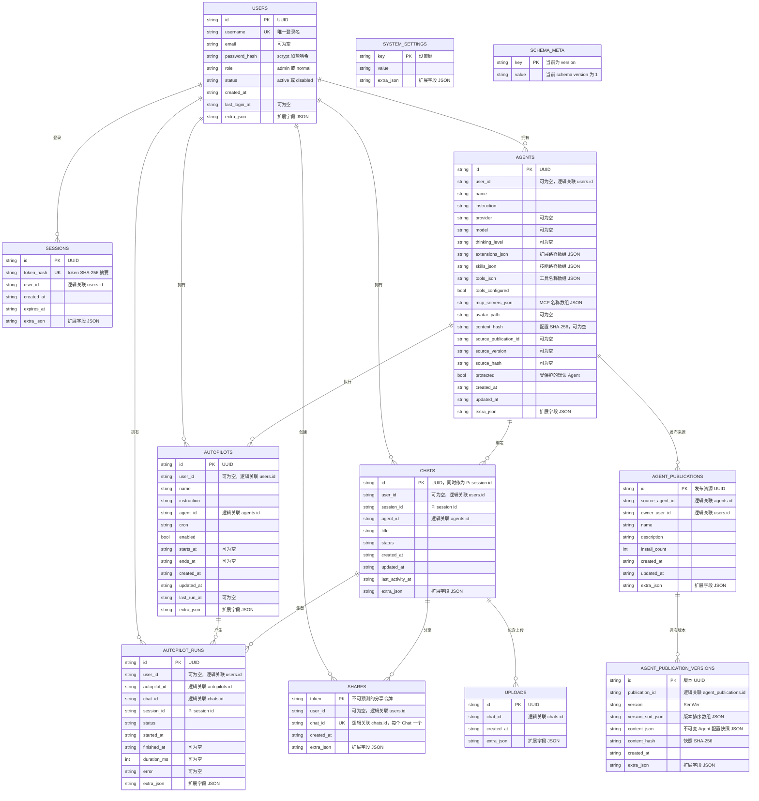

# OMA Studio SQLite 数据结构

OMA Studio 的平台元数据保存在 `platform.sqlite3`，由 SQLModel 和 SQLite 管理。当前数据库包含 12 张业务表，以及 1 张由存储层维护的 `schema_meta` 表，共 13 张表。

SQLite 是运行时唯一的元数据存储。旧的 `platform.json` 只用于一次性迁移：当目标 SQLite 文件不存在且 legacy JSON 存在时，应用会校验并导入数据，然后创建带 UTC 时间戳的 `.bak` 备份。Pi 消息正文、工具调用结果、完整对话记录和 Pi 原生 session 文件仍由 Pi 管理，不写入 SQLite。

## ER 图

下面的连线表示应用层的逻辑关系。当前 SQLModel 字段使用 ID 约定和索引表达关联，数据库本身没有声明 `FOREIGN KEY` 约束；删除级联和跨表一致性由 `Store` 与业务路由维护。



## 物理表和字段

### `users`

保存平台登录用户。`username` 有唯一索引，`role` 当前为 `admin` 或 `normal`，`status` 当前为 `active` 或 `disabled`。密码只保存 scrypt 加盐哈希，明文密码不会进入数据库。`extra_json` 用于兼容 Store 字典接口中的未建模扩展字段。

### `sessions`

保存登录 session 的摘要。浏览器持有 HttpOnly cookie 中的原始 token，数据库只保存 `token_hash`。`token_hash` 有唯一索引，`user_id` 有普通索引。Session 默认有效期为 24 小时，logout 和删除用户时由应用层清理。

### `agents`

保存 Agent 配置。`provider`、`model` 和 `thinking_level` 是 Pi 模型选择参数。`extensions_json`、`skills_json`、`tools_json` 和 `mcp_servers_json` 是 JSON 字符串列，Store 读写时转换为 Python 字符串数组。`content_hash` 和 `source_*` 用于 Agent 配置快照及 Marketplace 安装来源追踪。

系统会创建受保护的默认 Agent。`avatar_path` 只保存头像路径，头像文件保存在文件系统中，不存入 SQLite BLOB。

### `chats`

保存 Chat 索引和展示元数据。`id` 与 `session_id` 共同指向同一个 Pi session，平台没有额外映射表。`agent_id` 在 Chat 创建时确定，之后不会更换。消息正文、工具调用和 transcript 不在此表中。

### `autopilots`

保存定时任务配置。`agent_id` 指定执行任务的 Agent，`cron` 保存调度表达式，`starts_at` / `ends_at` 限制生效时间，`last_run_at` 记录最近一次调度时间。

### `autopilot_runs`

保存每次 Autopilot 执行记录，同时记录 `autopilot_id`、`chat_id` 和 Pi `session_id`。旧的 `running` 记录会在应用启动时被标记为取消并补充结束信息。运行产生的消息仍由 Pi session 管理。

### `shares`

保存 Chat 分享令牌。`token` 是主键，`chat_id` 有唯一索引，因此当前应用逻辑为一个 Chat 最多一条分享记录。删除 Chat 时，Store 会先删除对应的 shares 和 uploads 记录。

### `uploads`

保存 Chat 上传文件的元数据索引，只包含上传记录的 ID、所属 Chat 和创建时间。实际上传文件位于 Chat 作用域的 workspace 文件目录，文件内容不写入 SQLite。

### `agent_publications`

保存 Marketplace 中发布的 Agent 资源。`source_agent_id` 追踪发布时的用户 Agent，`owner_user_id` 记录发布者，`install_count` 记录安装次数。发布资源与实际安装后的私有 Agent 实例分开保存。

### `agent_publication_versions`

保存 Marketplace 发布资源的不可变版本。`content_json` 是 Agent 配置快照，`version_sort_json` 保存用于版本比较的解析结果，`content_hash` 是快照哈希。更新发布会新增版本，不覆盖历史版本。

### `system_settings`

保存平台级 key/value 设置，例如系统时区。`key` 是主键，值统一以字符串保存，由应用层负责解释和校验。

### `schema_meta`

由 `create_sqlite_engine()` 单独创建，用于记录存储 schema 版本。当前写入 `key = 'version'`、`value = '1'`。它不属于 `TABLE_MODELS`，也不参与 legacy TinyDB 数据迁移。

## 索引和关系约束

SQLModel 当前创建的索引如下：

| 表 | 索引 | 类型 |
| --- | --- | --- |
| `users` | `username` | 唯一 |
| `sessions` | `token_hash` | 唯一 |
| `sessions` | `user_id` | 普通 |
| `agents` | `user_id` | 普通 |
| `chats` | `user_id`、`agent_id` | 普通 |
| `autopilots` | `user_id`、`agent_id` | 普通 |
| `autopilot_runs` | `user_id`、`autopilot_id`、`chat_id` | 普通 |
| `shares` | `chat_id` | 唯一 |
| `shares` | `user_id` | 普通 |
| `uploads` | `chat_id` | 普通 |
| `agent_publications` | `source_agent_id`、`owner_user_id` | 普通 |
| `agent_publication_versions` | `publication_id` | 普通 |

当前数据库没有 SQL `FOREIGN KEY` 约束。下列关系由应用层维护：

- 删除用户时清理其 sessions；用户删除权限和关联业务记录由应用层控制。
- 删除 Chat 时清理其 shares 和 uploads；Pi session 和 workspace 文件另行处理。
- 删除 Agent 时由业务逻辑检查受保护状态和关联使用情况。
- `autopilot_runs` 继承 Autopilot / Chat 的用户归属，访问控制由路由层验证。
- Marketplace publication 与 version 的存在性和归属由 Store / router 维护。

## SQLite 初始化和 legacy 迁移

应用启动时执行以下流程：

1. `Store` 使用 `platform.sqlite3` 初始化。
2. 如果 SQLite 不存在而同目录存在 `platform.json`，读取并校验 legacy TinyDB 数据。
3. 将 12 张 legacy 表导入临时 SQLite 文件，逐表核对记录数量。
4. 复制原始 JSON 为带 UTC 时间戳的 `.bak` 文件。
5. 原子替换为 `platform.sqlite3`，随后由 SQLModel 创建缺失表并写入 `schema_meta.version`。

迁移是一次性的：只要 `platform.sqlite3` 已存在，应用不会重复读取 `platform.json`。操作者也可以显式预览或执行迁移：

```bash
uv run python scripts/migrate_tinydb_to_sqlite.py --data ~/.oma-studio/data
uv run python scripts/migrate_tinydb_to_sqlite.py --data ~/.oma-studio/data --apply
```

## 数据边界

SQLite 只保存 OMA Studio 平台元数据：

- Agent 配置、头像路径和 Marketplace 发布快照
- Chat 索引、标题、状态和 Pi session 标识
- Autopilot 配置和运行索引
- Chat 分享令牌
- 用户、登录 session 和系统设置
- Chat 上传文件的元数据

以下内容不写入 SQLite：

- 用户消息和 Agent 回复
- 工具调用参数与工具返回结果
- Pi session transcript 和原生 session 事件
- Chat 生成文件和上传文件的正文
- 用户明文密码和浏览器 session token 原文

`PI_CWD` 中的生成文件通过 Pi 工具调用记录发现，并经过 Chat 授权规则读取。SQLite 只保存必要的元数据和索引，不复制文件内容或 Pi 消息历史。
