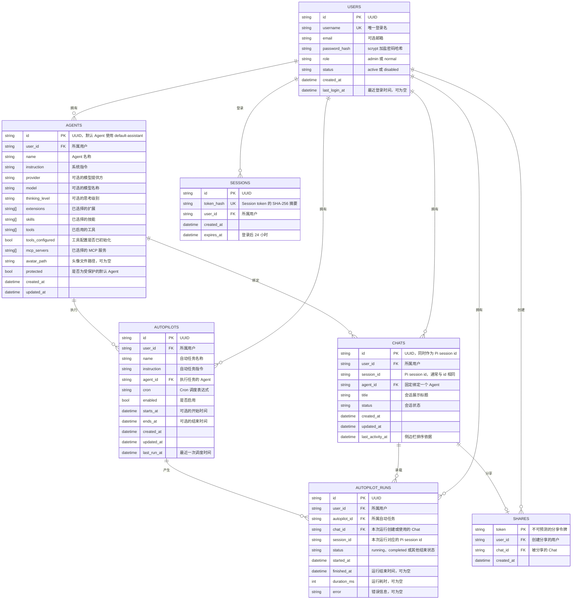

# TinyDB 数据结构

OMA Studio 的平台元数据保存在 `~/.oma-studio/data/platform.json`。当前由 `app/store.py` 创建并管理七张 TinyDB 表。消息正文、工具调用结果、完整对话记录和 Pi 原生 session 文件不在本文范围内，也不会写入这些表。

## ER 图



## 表说明

### `agents`

保存 Agent 的配置快照。`extensions`、`skills`、`tools` 和 `mcp_servers` 都是字符串数组，表示该 Agent 主动选择的资源。资源是否存在、是否可以被选择，会在写入前由应用层根据发现结果校验。

每个 Agent 都有唯一 `id`。系统会自动创建 `default-assistant`，它带有 `protected = true`，不能通过普通删除接口移除。`avatar_path` 只保存头像路径，头像文件本身由文件系统保存。

### `chats`

保存聊天索引和展示所需的元数据。`agent_id` 在 Chat 创建时确定，之后不会更换。`id` 和 `session_id` 设计上指向同一个 Pi session，平台没有额外的映射表。

`last_activity_at` 用于 Chat 列表排序，`updated_at` 记录元数据变更。两者分开维护，因此读取历史消息不会改变 Chat 的排序位置。

### `autopilots`

保存定时自动任务的配置。`agent_id` 指定每次运行使用的 Agent，`cron` 保存调度表达式，`starts_at` 和 `ends_at` 用于限制生效区间。`last_run_at` 记录最近一次被调度的时间，用于避免同一个时间点重复触发。

### `autopilot_runs`

保存自动任务每次执行的运行记录。它同时关联一个 `autopilot_id` 和一个 `chat_id`，因此可以从自动任务追踪到具体 Chat。`session_id` 只是本次运行的 Pi session 标识，Pi session 的消息和 transcript 仍由 Pi 管理。

应用启动时，如果发现状态仍为 `running` 的旧记录，会将其标记为取消，并写入结束时间和错误说明。

### `shares`

保存 Chat 的公开分享令牌。当前应用逻辑为一个 Chat 最多创建一个分享记录，重复创建时复用已有记录。删除 Chat 时会先删除对应的分享记录。

### `users`

保存平台登录用户和管理状态。`username` 由应用层保证唯一，`role` 目前只有
`admin` 和 `normal`。系统首次启动时会从运行时配置初始化内置 admin 用户；密码
只以 scrypt 加盐哈希保存，`password_hash` 不会通过 API 返回。普通用户由 admin
创建，初始密码由运行时配置提供，当前不支持注册或修改密码。

`status = disabled` 的用户不能登录。内置 admin 不能被删除或禁用。

### `sessions`

保存登录 session 的摘要和过期时间。浏览器只持有 HttpOnly cookie 中的原始 token，
TinyDB 只保存 token 的 SHA-256 摘要。Session 默认 24 小时过期，主动 logout 时会
删除对应记录并清除 cookie。删除用户时会清理该用户的 session 记录，这是应用层实现
的级联行为。

## 关系和约束

| 关系 | 含义 |
| --- | --- |
| `agents.id` → `chats.agent_id` | 一个 Agent 可以绑定多个 Chat，一个 Chat 固定绑定一个 Agent |
| `agents.id` → `autopilots.agent_id` | 一个 Agent 可以被多个自动任务使用 |
| `autopilots.id` → `autopilot_runs.autopilot_id` | 一个自动任务可以产生多条运行记录 |
| `chats.id` → `autopilot_runs.chat_id` | 一条运行记录关联一个 Chat |
| `chats.id` → `shares.chat_id` | 一个 Chat 最多有一条分享记录，由应用层保证 |
| `users.id` → `agents.user_id` | 一个用户可以拥有多个 Agent；管理员可以查看全部 |
| `users.id` → `chats.user_id` | 一个用户可以拥有多个 Chat；Chat 同时固定绑定一个 Agent |
| `users.id` → `autopilots.user_id` | 一个用户可以拥有多个自动任务 |
| `users.id` → `autopilot_runs.user_id` | 运行记录继承所属自动任务/Chat 的用户归属 |
| `users.id` → `shares.user_id` | 分享记录记录创建者；分享链接本身仍按 token 公开访问 |
| `users.id` → `sessions.user_id` | 一个用户可以有多个登录 session，删除用户时清理其 session |

TinyDB 的这些表没有 SQL 意义上的外键、唯一索引或级联约束。`PK` 和 `FK` 表示当前代码中的身份字段和关联字段，实际约束由 `Store` 及 API 逻辑维护。

普通用户只能读取和修改自己拥有的 Agents、Chats、Autopilots、Runs 和 Shares；管理员可以跨用户查看和管理这些记录。Marketplace 的 Skills 和 Extensions 是全局资源，仅管理员可以安装或卸载，不属于某个用户。

历史数据不在应用启动时自动迁移。部署或本地升级时由操作者执行一次性回填脚本；脚本默认只预览，带 `--apply` 才会写入，重复执行不会产生额外修改：

```bash
uv run python scripts/backfill_user_ownership.py --data ~/.oma-studio/data
uv run python scripts/backfill_user_ownership.py --data ~/.oma-studio/data --apply
```

## 数据边界

TinyDB 只承担平台索引和元数据存储，主要包括 Agent 配置、Chat 索引、自动任务配置、自动任务运行状态、分享令牌、用户身份和登录 session 摘要。

以下数据不属于 TinyDB

- 用户消息和 Agent 回复
- 工具调用参数与工具返回结果
- Pi session transcript
- Pi 原生 session 文件及其内部事件
- Chat 生成文件的内容
- 用户明文密码和浏览器 session token 原文

Chat 生成文件通过 Pi 工具调用记录发现，并按授权规则从 `PI_CWD` 读取。TinyDB 不保存这些文件的正文。
